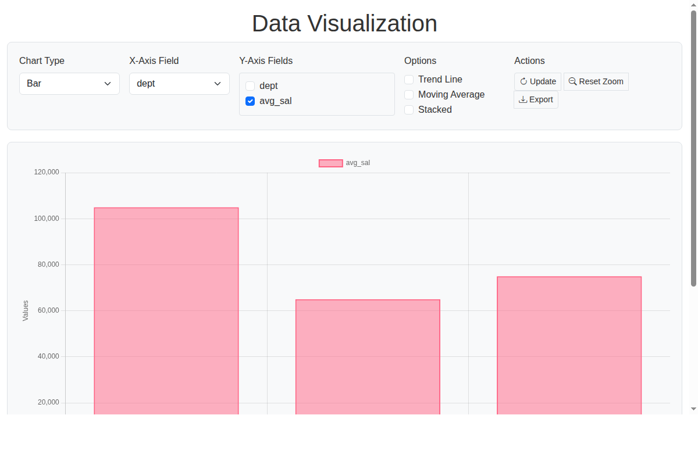

# ssql 🚀

**Modern Go stream processing made simple** - Transform data with intuitive operations, create interactive visualizations, and even generate code from natural language descriptions.

Built on Go 1.23+ with first-class support for iterators, generics, and functional composition.

> **⚠️ Important:** ssql v4 requires the `/v4` import path:
> ```go
> import "github.com/rosscartlidge/ssql/v4"
> ```

## ✨ What Makes ssql Special

### 🎯 **Simple Yet Powerful**

**Go Library:**
```go
// Read data, filter, group, and visualize - all type-safe
sales, err := ssql.ReadCSV("sales.csv")
if err != nil {
    log.Fatal(err)
}

topRegions := ssql.Chain(
    ssql.GroupByFields("sales", "region"),
    ssql.Aggregate("sales", map[string]ssql.AggregateFunc{
        "total_revenue": ssql.Sum("amount"),
    }),
    ssql.SortBy(func(r ssql.Record) float64 {
        return -ssql.GetOr(r, "total_revenue", 0.0) // Descending
    }),
    ssql.Limit[ssql.Record](5),
)(sales)

ssql.QuickChart(topRegions, "region", "total_revenue", "top_regions.html")
```

<details>
<summary>💡 <b>Click for complete, runnable code with sample data</b></summary>

```go
package main

import (
    "log"
    "os"
    "github.com/rosscartlidge/ssql/v4"
)

func main() {
    // Create sample sales data in /tmp/sales.csv
    csvData := `region,product,amount
North,Widget,1500
South,Gadget,2300
East,Widget,1800
West,Gadget,2100
North,Gadget,3200
South,Widget,1200
East,Gadget,2800
West,Widget,1600
North,Widget,2500
South,Gadget,1900
East,Widget,2200
West,Gadget,3100`

    if err := os.WriteFile("/tmp/sales.csv", []byte(csvData), 0644); err != nil {
        log.Fatalf("Failed to create sample data: %v", err)
    }

    // Read data, filter, group, and visualize - all type-safe
    sales, err := ssql.ReadCSV("/tmp/sales.csv")
    if err != nil {
        log.Fatal(err)
    }

    topRegions := ssql.Chain(
        ssql.GroupByFields("sales", "region"),
        ssql.Aggregate("sales", map[string]ssql.AggregateFunc{
            "total_revenue": ssql.Sum("amount"),
        }),
        ssql.SortBy(func(r ssql.Record) float64 {
            return -ssql.GetOr(r, "total_revenue", 0.0) // Descending
        }),
        ssql.Limit[ssql.Record](5),
    )(sales)

    if err := ssql.QuickChart(topRegions, "region", "total_revenue", "/tmp/top_regions.html"); err != nil {
        log.Fatalf("Failed to create chart: %v", err)
    }

    log.Println("Chart created: /tmp/top_regions.html")
    log.Println("Sample data: /tmp/sales.csv")
}
```

</details>

**Or use the CLI:**


```bash
# Prototype with Unix-style pipelines, then generate production Go code
ssql from employees.csv | \
  ssql group-by dept -count n -avg salary avg_sal | \
  ssql to chart -x dept -y avg_sal -output chart.html

# Window functions — rankings, running totals, lag/lead without collapsing rows
ssql from employees.csv | ssql window -row-number rn -partition dept -order salary -desc

# Read multiple files at once (shell expands *.csv)
ssql from csv *.csv -source file | ssql group-by file -count n | ssql to table

# Multi-file pushdown — filter per file in parallel, then merge (4x faster)
ssql from csv *.csv -- where -if age gt 25 | ssql to table

# Schema headers are automatic - preserves field order through pipelines
ssql from data.csv | ssql where -if age gt 30 | ssql to csv output.csv

# High-performance Arrow format (10-20x faster I/O)
ssql from data.arrow | ssql where -if age gt 30 | ssql to arrow output.arrow

# Excel files — read and write .xlsx directly
ssql from xlsx sales.xlsx -sheet "Q4 Results" | ssql where -if revenue gt 50000 | ssql to xlsx top.xlsx

# Distributed processing: read remote files via SSH
ssql from ssh myserver /data/events.csv -- where -if status eq error | ssql to table

# Read multiple shards from a catalog, with partition pruning
ssql from catalog shards.csv -if date ge 2025-03-01 | ssql group-by service -count n

# Optimize a pipeline — push filters into SSH, collapse sort+limit to top
(export SSQLGO=1; ssql from ssh node1 /data/events.csv \
  | ssql where -if status ge 500 \
  | ssql sort -desc cnt | ssql limit 10 \
  | ssql to table) | ssql generate ssql
# → ssql from ssh node1 /data/events.csv -- where -if status ge 500 | ssql top 10 -field cnt | ssql to table

# Chain: optimize → then compile to Go
(export SSQLGO=1; ...) | ssql generate ssql | ssql generate go

# Debug pipelines with jq (JSONL streaming format)
ssql from data.csv | jq '.' | head -5  # Inspect data
ssql from data.csv | ssql where -if age gt 30 | jq -s 'length'  # Count results
```

**Optimize and compile to Go:**


[**Try the CLI →**](doc/cli-codelab.md) | [**Debug with jq →**](doc/cli-debugging.md)

### 🌐 **Browser Playground**

Try ssql without installing anything — the full CLI runs in your browser via WebAssembly:

**[Launch Playground →](https://rosscartlidge.github.io/ssql/playground.html)** *(instant — optimized WASM, ~13MB)*

**[Launch Full Terminal →](https://rosscartlidge.github.io/ssql-terminal/)** *(real Linux with bash, tab completion, pipes — boots in ~20s)*

Or build the playground locally:
```bash
make playground
cd cmd/ssql-playground && python3 -m http.server 8080
# Open http://localhost:8080/playground.html
```

Features:
- Type real ssql pipelines and see results instantly
- **Optimize** — see the pipeline optimizer rewrite your commands with `-explain`
- **Generate Go** — compile pipelines to standalone Go code
- **Generate SQL** — convert to DuckDB-compatible SQL
- **Process substitution** — `<(ssql from ... | ssql where ...)` works in joins
- Sample datasets included (employees, orders, customers)
- Upload your own CSV files

> **Note:** SSH and catalog commands require network access and are not available in the browser. Use Optimize or Generate Go to see how those pipelines would be rewritten.

### 🤖 **AI-Powered Code Generation**
Describe what you want in plain English, get working ssql code:

> *"Read customer data, find high-value customers, group by region, create a chart"*

→ **Generates clean, readable Go code automatically**

[**Try the AI Assistant →**](doc/ai-human-guide.md)

### 📊 **Interactive Visualizations**
Create modern, responsive charts with zoom, pan, and filtering capabilities:

```bash
ssql from data.csv | ssql group-by dept -avg salary avg_sal | ssql to chart -x dept -y avg_sal -type bar
```



Charts are self-contained HTML files with Chart.js — interactive controls, trend lines, export to PNG. Also supports animated visualizations (`to animate`) for time-series and frequency spectra.

[**Try charts in the playground →**](https://rosscartlidge.github.io/ssql/playground.html)

## 🚀 Quick Start

### Prerequisites
- **Go 1.23+** required for iterator support

**Don't have Go installed?**
- macOS: `brew install go`
- Linux/Windows: [Download from go.dev](https://go.dev/dl/)
- Verify: `go version` (should show 1.23+)

### Installation

#### Option 1: Homebrew (macOS & Linux)

```bash
brew tap rosscartlidge/ssql
brew install ssql
ssql version
```

#### Option 2: Go Install

```bash
go install github.com/rosscartlidge/ssql/v4/cmd/ssql@latest

# Verify installation
ssql version

# Try it out
echo "name,age,salary
Alice,30,95000
Bob,25,65000" | ssql from csv | ssql where -if age gt 28
```

[**See CLI Tutorial →**](doc/cli-codelab.md)

#### Option 3: Download Binary

Pre-built binaries for all platforms are available on [GitHub Releases](https://github.com/rosscartlidge/ssql/releases). Download the archive for your OS/architecture, extract, and add to your PATH.

#### Option 4: WASI (run anywhere)

A single `.wasm` binary that runs on any platform with a WASI runtime ([wasmtime](https://wasmtime.dev/), wasmer, Docker+WASM):

```bash
# Download from GitHub Releases
curl -LO https://github.com/rosscartlidge/ssql/releases/latest/download/ssql_wasi.tar.gz
tar xzf ssql_wasi.tar.gz

# Run with wasmtime
wasmtime ssql.wasm version
wasmtime --dir=. ssql.wasm from data.csv | wasmtime ssql.wasm where -if age gt 25 | wasmtime ssql.wasm to table
```

No Go, no cross-compilation — one binary for every platform. 14MB slim build.

#### Option 5: GPU Acceleration (optional)

For 10-50x faster FFT, convolution, and correlation on large signals:

**Requirements:**
- NVIDIA GPU with CUDA support
- Docker with nvidia-container-toolkit, OR CUDA Toolkit installed locally

**Method 1: Docker Build (Recommended - no local CUDA needed)**

```bash
# Clone the repository
git clone https://github.com/rosscartlidge/ssql.git
cd ssql

# Build and extract the GPU-enabled binary
make docker-gpu-extract

# Install the library system-wide
sudo cp libssqlgpu.so /usr/local/lib && sudo ldconfig

# Install the binary
cp ssql_gpu ~/go/bin/

# Verify GPU is detected
ssql_gpu version
# Output: ssql vX.Y.Z (gpu: yes)
```

**Method 2: Local CUDA Toolkit Build**

```bash
# Clone the repository
git clone https://github.com/rosscartlidge/ssql.git
cd ssql

# Build the CUDA library
cd gpu && make && cd ..

# Build ssql with GPU support
go build -tags gpu -o ssql_gpu ./cmd/ssql

# Install to your Go bin directory
sudo make install-gpu  # Installs libssqlgpu.so to /usr/local/lib
cp ssql_gpu ~/go/bin/

# Verify GPU is detected
ssql_gpu version
```

**Note:** The GPU version falls back to CPU automatically when GPU is unavailable or for small datasets where CPU is faster.

#### Option 6: Debian Packages

Pre-built `.deb` packages are available for amd64 Linux systems:

**Standard version (no GPU dependencies):**
```bash
curl -LO https://github.com/rosscartlidge/ssql/raw/main/ssql_4.34.0_amd64.deb
sudo dpkg -i ssql_4.34.0_amd64.deb
ssql version
```

**GPU-accelerated version (requires NVIDIA CUDA runtime):**
```bash
curl -LO https://github.com/rosscartlidge/ssql/raw/main/ssql-gpu_4.34.0_amd64.deb
sudo dpkg -i ssql-gpu_4.34.0_amd64.deb
ssql version
```

The GPU package requires `libcudart` (CUDA runtime) which is typically installed with NVIDIA drivers.

#### Option 7: Go Library (for application development)

**Step 1: Create a new project**
```bash
mkdir my-project
cd my-project
go mod init myproject  # Initialize Go module (required!)
```

**Step 2: Install ssql v4**
```bash
go get github.com/rosscartlidge/ssql/v4
```

### Hello ssql
```go
package main

import (
    "fmt"
    "slices"
    "github.com/rosscartlidge/ssql/v4"
)

func main() {
    numbers := slices.Values([]int{1, 2, 3, 4, 5, 6, 7, 8, 9, 10})

    evenNumbers := ssql.Where(func(x int) bool {
        return x%2 == 0
    })(numbers)

    first3 := ssql.Limit[int](3)(evenNumbers)

    fmt.Println("First 3 even numbers:")
    for num := range first3 {
        fmt.Println(num) // 2, 4, 6
    }
}
```

### Your First Chart
```go
package main

import (
    "slices"
    "github.com/rosscartlidge/ssql/v4"
)

func main() {
    // Create sample data
    monthlyRevenue := []ssql.Record{
        ssql.MakeMutableRecord().String("month", "Jan").Float("revenue", 120000).Freeze(),
        ssql.MakeMutableRecord().String("month", "Feb").Float("revenue", 135000).Freeze(),
        ssql.MakeMutableRecord().String("month", "Mar").Float("revenue", 118000).Freeze(),
    }

    data := slices.Values(monthlyRevenue)

    // Generate interactive chart
    ssql.QuickChart(data, "month", "revenue", "revenue_chart.html")
    // Opens in browser with zoom, pan, and export features
}
```

## 🎓 Learning Path

**New to ssql?** We've got you covered with step-by-step guides:

### 1. ⚡ **[CLI Tutorial](doc/cli-codelab.md)**
*Prototype fast with Unix-style pipelines, generate production code*
- Quick data exploration with command-line tools
- Process system commands (ps, df, etc.)
- Create visualizations with one command
- Generate Go code from CLI pipelines
- **Debug pipelines with jq** - [See debugging guide →](doc/cli-debugging.md)
- **Perfect for rapid prototyping!**

### 2. 📚 **[Getting Started Guide](doc/codelab-intro.md)**
*Learn the Go library fundamentals with hands-on examples*
- Basic operations (Select, Where, Limit)
- Working with CSV/JSON/Arrow/XLSX data
  - **⚠️ Note**: CSV auto-parses `"25"` → `int64(25)`, use correct types with `GetOr()`
- Creating your first visualizations
- Real-world examples

### 2b. 📊 **[Signal Processing Guide](doc/cli-signal-processing.md)**
*FFT, filtering, and GPU-accelerated analysis*
- Frequency analysis with FFT/IFFT
- Convolution for smoothing and edge detection
- Cross-correlation for pattern matching
- Optional GPU acceleration (10-100x speedup)

### 3. 📖 **[API Reference](doc/api-reference.md)**
*Complete function documentation with examples*
- All operations organized by category
- Transform, Filter, Aggregate, Join operations
- Window processing for real-time data
- Chart and visualization options

### 4. 🎯 **[Advanced Tutorial](doc/advanced-tutorial.md)**
*Master complex patterns and production techniques*
- Stream joins and complex aggregations
- Real-time processing with windowing
- Infinite stream handling
- Performance optimization

### 5. 🤖 **[AI Code Generation](doc/ai-human-guide.md)**
*Generate ssql code from natural language*
- Use any AI assistant (Claude, ChatGPT, Gemini)
- Describe what you want, get working code
- Human-readable, verifiable results
- Perfect for rapid prototyping
- **For LLMs**: Copy [ai-code-generation.md](doc/ai-code-generation.md) into your LLM

## 🔧 Core Capabilities

### **SQL-Style Data Processing**

**Quick view:**
```go
// Group sales by region, calculate totals, get top 5
topRegions := ssql.Chain(
    ssql.GroupByFields("sales", "region"),
    ssql.Aggregate("sales", aggregations),
    ssql.SortBy(keyFunc),
    ssql.Limit[ssql.Record](5),
)(salesData)
```

<details>
<summary>📋 <b>Click for complete, runnable code</b></summary>

```go
package main

import (
    "fmt"
    "log"
    "github.com/rosscartlidge/ssql/v4"
)

func main() {
    // Read sales data
    salesData, err := ssql.ReadCSV("sales.csv")
    if err != nil {
        log.Fatal(err)
    }

    // Define aggregations
    aggregations := map[string]ssql.AggregateFunc{
        "total_revenue": ssql.Sum("amount"),
        "sale_count":    ssql.Count(),
    }

    // Define sort key function
    keyFunc := func(r ssql.Record) float64 {
        return -ssql.GetOr(r, "total_revenue", 0.0) // Negative for descending
    }

    // Group sales by region, calculate totals, get top 5
    topRegions := ssql.Chain(
        ssql.GroupByFields("sales", "region"),
        ssql.Aggregate("sales", aggregations),
        ssql.SortBy(keyFunc),
        ssql.Limit[ssql.Record](5),
    )(salesData)

    // Display results
    fmt.Println("Top 5 Regions by Revenue:")
    for region := range topRegions {
        name := ssql.GetOr(region, "region", "")
        revenue := ssql.GetOr(region, "total_revenue", 0.0)
        count := ssql.GetOr(region, "sale_count", int64(0))
        fmt.Printf("%s: $%.2f (%d sales)\n", name, revenue, count)
    }
}
```

</details>

### **Real-Time Stream Processing**

**Quick view:**
```go
// Process sensor data in 5-minute windows
windowed := ssql.TimeWindow[ssql.Record](5*time.Minute, "timestamp")(sensorStream)
for window := range windowed {
    // Analyze each time window
}
```

<details>
<summary>📋 <b>Click for complete, runnable code</b></summary>

```go
package main

import (
    "fmt"
    "log"
    "time"
    "github.com/rosscartlidge/ssql/v4"
)

func main() {
    // Read sensor data
    sensorStream, err := ssql.ReadCSV("sensor_data.csv")
    if err != nil {
        log.Fatal(err)
    }

    // Process sensor data in 5-minute windows
    windowed := ssql.TimeWindow[ssql.Record](5*time.Minute, "timestamp")(sensorStream)

    fmt.Println("Processing 5-minute windows:")
    for window := range windowed {
        // Analyze each time window
        count := len(window)

        // Calculate average temperature
        var totalTemp float64
        for _, record := range window {
            temp := ssql.GetOr(record, "temperature", 0.0)
            totalTemp += temp
        }
        avgTemp := totalTemp / float64(count)

        fmt.Printf("Window: %d readings, avg temp: %.2f°C\n", count, avgTemp)
    }
}
```

</details>

### **Interactive Dashboards**

**Quick view:**
```go
config := ssql.DefaultChartConfig()
config.Title = "Sales Dashboard"
config.ChartType = "line"
ssql.InteractiveChart(data, "dashboard.html", config)
```

<details>
<summary>📋 <b>Click for complete, runnable code</b></summary>

```go
package main

import (
    "log"
    "slices"
    "github.com/rosscartlidge/ssql/v4"
)

func main() {
    // Create sample sales data
    salesData := []ssql.Record{
        ssql.MakeMutableRecord().String("month", "Jan").Float("revenue", 120000).Freeze(),
        ssql.MakeMutableRecord().String("month", "Feb").Float("revenue", 135000).Freeze(),
        ssql.MakeMutableRecord().String("month", "Mar").Float("revenue", 145000).Freeze(),
        ssql.MakeMutableRecord().String("month", "Apr").Float("revenue", 132000).Freeze(),
    }

    data := slices.Values(salesData)

    // Create interactive dashboard
    config := ssql.DefaultChartConfig()
    config.Title = "Sales Dashboard"
    config.ChartType = "line"
    config.Width = 1200
    config.Height = 600
    config.EnableZoom = true
    config.EnablePan = true

    err := ssql.InteractiveChart(data, "dashboard.html", config)
    if err != nil {
        log.Fatalf("Failed to create chart: %v", err)
    }

    log.Println("Dashboard created: dashboard.html")
}
```

</details>

### **Signal Processing**

**Quick view:**
```go
// FFT analysis, filtering, and reconstruction
spectrum, _ := ssql.FFTWithPhase(signal)
reconstructed, _ := ssql.IFFT(spectrum.Magnitude, spectrum.Phase)
smoothed, _ := ssql.Convolve(signal, ssql.GaussianKernel(11, 2.0))
corr, _ := ssql.Correlate(signal1, signal2)  // Find pattern matches
```

<details>
<summary>📋 <b>Click for complete, runnable code</b></summary>

```go
package main

import (
    "fmt"
    "math"
    "github.com/rosscartlidge/ssql/v4"
)

func main() {
    // Create sample signal: 10Hz + 25Hz sine waves
    sampleRate := 100.0 // 100 samples per second
    signal := make(ssql.Signal, 256)
    for i := range signal {
        t := float64(i) / sampleRate
        signal[i] = math.Sin(2*math.Pi*10*t) + 0.5*math.Sin(2*math.Pi*25*t)
    }

    // FFT to find frequency components
    spectrum, err := ssql.FFT(signal)
    if err != nil {
        panic(err)
    }

    // Find peak frequencies
    fmt.Println("Top frequencies:")
    for i, mag := range spectrum.Magnitude {
        if mag > 50 { // Threshold for significant peaks
            freq := spectrum.FrequencyBin(i, sampleRate)
            fmt.Printf("  %.1f Hz: magnitude %.1f\n", freq, mag)
        }
    }

    // Smooth with Gaussian kernel
    smoothed, err := ssql.ConvolveSame(signal, ssql.GaussianKernel(11, 2.0))
    if err != nil {
        panic(err)
    }
    fmt.Printf("\nSmoothed signal: %d points\n", len(smoothed))
}
```

</details>

**CLI Usage:**
```bash
# FFT analysis
ssql from audio.csv | ssql fft -field amplitude -rate 44100 | ssql to table

# Inverse FFT for signal reconstruction
ssql from spectrum.csv | ssql ifft -magnitude mag -phase phase | ssql to csv filtered.csv

# Smoothing with convolution
ssql from sensor.csv | ssql convolve -field reading -kernel gaussian -size 11 -same

# Cross-correlation to find patterns
ssql from signal.csv | ssql correlate -field reading -with template.csv
```

**Features:**
- **FFT/IFFT** - Forward and inverse FFT for frequency analysis and signal reconstruction
- **Convolution** - Signal filtering with built-in kernels (avg, gaussian, diff, laplacian, sobel)
- **Correlation** - Cross-correlation and autocorrelation for pattern matching
- **Pipeline Integration** - Works with ssql's record-based pipelines
- **Works everywhere** - CPU implementations included, no special setup required

**GPU Acceleration (optional):**
Signal processing works out of the box using CPU. For large datasets, optional CUDA GPU acceleration provides 10-100x speedup. See [GPU installation instructions](#option-1b-cli-tool-with-gpu-acceleration-optional) for setup via Docker (recommended) or local CUDA toolkit.

GPU is used automatically when available for FFT >= 1024 points or convolution kernels >= 64 points.

### **Data Integration**

**Quick view:**
```go
// Join customer and order data
customerOrders := ssql.InnerJoin(
    orderStream,
    ssql.OnFields("customer_id")
)(customerStream)
```

<details>
<summary>📋 <b>Click for complete, runnable code</b></summary>

```go
package main

import (
    "fmt"
    "log"
    "github.com/rosscartlidge/ssql/v4"
)

func main() {
    // Read customer data
    customerStream, err := ssql.ReadCSV("customers.csv")
    if err != nil {
        log.Fatal(err)
    }

    // Read order data
    orderStream, err := ssql.ReadCSV("orders.csv")
    if err != nil {
        log.Fatal(err)
    }

    // Join customer and order data
    customerOrders := ssql.InnerJoin(
        orderStream,
        ssql.OnFields("customer_id"),
    )(customerStream)

    // Display joined results
    fmt.Println("Customer Orders:")
    for record := range customerOrders {
        custName := ssql.GetOr(record, "customer_name", "")
        orderID := ssql.GetOr(record, "order_id", "")
        amount := ssql.GetOr(record, "amount", 0.0)
        fmt.Printf("%s - Order %s: $%.2f\n", custName, orderID, amount)
    }
}
```

</details>

### **Distributed Processing**

**Quick view:**
```bash
# Read a remote file via SSH with push-down filtering
ssql from ssh myserver /data/events.csv -- where -if status eq error | ssql to table

# Read multiple shards from a catalog CSV with partition pruning
ssql from catalog shards.csv -if date ge 2025-03-01 | ssql group-by service -count n
```

<details>
<summary>Click for more examples</summary>

```bash
# Multi-step push-down: filter and aggregate on each remote shard
ssql from ssh myserver /data/events.csv \
  -- where -if status ge 400 + group-by service -count cnt | \
  ssql to table

# Catalog with range pruning and two-level aggregation
ssql from catalog shards.csv -if date ge 2025-02-01 \
  -- where -if status ge 400 + group-by service -count cnt | \
  ssql group-by service -sum cnt total_errors | \
  ssql to table

# Add provenance to track which shard each record came from
ssql from catalog shards.csv -shard-field _shard | ssql to table

# Use ssql_gpu on remote hosts
ssql from ssh myserver /data/events.csv -gpu | ssql to table
```

**Features:**
- **`from ssh`** - Read remote files via SSH, push-down filters to reduce transfer
- **`from catalog`** - Read multiple shards from a catalog CSV mapping hosts to file paths
- **Partition pruning** - Skip irrelevant shards using range (`X_from`/`X_to`) or exact-value metadata
- **Push-down** - Send filter and aggregation stages to remote hosts with `--` separator
- **Local shards** - Catalog entries with `host=local` or `host=localhost` are read directly
- **Code generation** - `from ssh` supports `-generate` / `SSQLGO=1`
- **Pipeline optimizer** - `generate ssql` automatically pushes filters into SSH/catalog, collapses sort+limit to top, prunes Parquet columns, and more (12 optimization rules)

</details>

### **Expression Support** ⚡

**Quick view:**
```bash
# Calculate derived fields with expressions
ssql update -set-expr total 'price * qty'
ssql update -set-expr tier 'revenue > 10000 ? "gold" : "silver"'

# Complex filtering with boolean expressions
ssql where -expr 'age >= 18 and status == "active"'
```

<details>
<summary>📋 <b>Click for complete, runnable code and features</b></summary>

ssql supports powerful expression evaluation for computed fields and complex filters using the [expr-lang](https://expr-lang.org/) library.

**CLI Examples:**
```bash
# Calculated fields
echo 'name,price,qty
Widget,10.50,3
Gadget,25.00,2' | ssql from | \
  ssql update -set-expr total 'price * qty' | \
  ssql update -set-expr discount 'total > 50 ? total * 0.1 : 0'

# Complex filtering
echo 'name,age,email,status
Alice,30,alice@example.com,active
Bob,17,bob@example.com,pending
Carol,25,carol@example.com,active' | ssql from | \
  ssql where -expr 'age >= 18 and status == "active" and has("email")'

# String manipulation
echo 'email
  ALICE@EXAMPLE.COM
bob@test.com' | ssql from | \
  ssql update -set-expr email 'lower(trim(email))'
```

**Library Examples:**
```go
package main

import (
    "fmt"
    "log"
    "github.com/rosscartlidge/ssql/v4"
    "github.com/rosscartlidge/ssql/v4/cmd/ssql/lib/runtime"
)

func main() {
    // Read sales data
    sales, err := ssql.ReadCSV("sales.csv")
    if err != nil {
        log.Fatal(err)
    }

    // Compile expression once
    calcTotal := runtime.MustCompileExpr("price * qty")

    // Apply to all records
    updated := ssql.Update(func(mut ssql.MutableRecord) ssql.MutableRecord {
        frozen := mut.Freeze()
        result, _ := calcTotal(frozen)
        if total, ok := result.(float64); ok {
            return mut.Float("total", total)
        }
        return mut
    })(sales)

    // Process results
    for record := range updated {
        total := ssql.GetOr(record, "total", 0.0)
        fmt.Printf("Total: $%.2f\n", total)
    }
}
```

**Features:**
- **30+ built-in functions** - Math (round, abs, min, max), string (upper, lower, trim, split), array (filter, map, sum), and type conversion
- **All operators** - Arithmetic (`+`, `-`, `*`, `/`, `%`, `**`), comparison (`==`, `!=`, `<`, `>`, `<=`, `>=`), logical (`and`, `or`, `not`)
- **Advanced syntax** - Ternary operator (`? :`), nil coalescing (`??`), membership (`in`), pipe (`|`)
- **Helper functions** - `has(field)` check existence, `getOr(field, default)` safe access with defaults
- **High performance** - Compile once (~100µs), evaluate many (~1-2µs per record)
- **Type safety** - Boolean expressions type-checked at compile time
- **Code generation** - Expressions pre-compiled in generated Go programs

**Use Cases:**
- **Data validation** - `where -expr 'age >= 0 and age <= 120 and has("email")'`
- **Data cleaning** - `update -set-expr email 'lower(trim(email))'`
- **Calculations** - `update -set-expr total 'round(price * qty * (1 - discount / 100))'`
- **Categorization** - `update -set-expr tier 'revenue > 10000 ? "gold" : "silver"'`
- **Complex filters** - `where -expr '(age >= 18 and status == "active") or role == "admin"'`

**Performance:**
```bash
# CLI execution (~1ms overhead for 1M records)
ssql from huge.csv | ssql where -expr 'price * qty > 1000'

# Code generation (10-100x faster, zero compilation overhead)
export SSQLGO=1
ssql from huge.csv | \
  ssql where -expr 'price * qty > 1000' | \
  ssql update -set-expr total 'price * qty' | \
  ssql generate go > optimized.go
go run optimized.go
```

**Full documentation:** [Expression Language Reference](doc/EXPRESSIONS.md)

</details>

## 🎨 Try the Examples

Run these to see ssql in action:

```bash
# Interactive chart showcase
go run examples/chart_demo.go

# Data analysis pipeline
go run examples/functional_example.go

# Real-time processing
go run examples/early_termination_example.go
```

## 🌟 Why Choose ssql?

- **🎯 Simple API** - If you know SQL, you know ssql
- **🔒 Type Safe** - Go generics catch errors at compile time
- **📊 Visual** - Create charts as easily as processing data
- **🤖 AI Ready** - Generate code from descriptions
- **⚡ Performance** - Lazy evaluation and memory efficiency
- **🔄 Composable** - Build complex pipelines from simple operations
- **🔍 Debuggable** - JSONL streaming works with jq and Unix tools

## 🎯 Perfect For

- **Data Scientists** - Analyze CSV/JSON/Arrow/XLSX files with ease
- **DevOps Engineers** - Monitor systems and create dashboards
- **Business Analysts** - Generate reports and visualizations
- **Developers** - Build ETL pipelines and data processing tools
- **Anyone** - Who wants to turn data descriptions into working code

## 🚀 What's Next?

1. **[Install ssql](#installation)** and try the quick start
2. **[Try the CLI](doc/cli-codelab.md)** for rapid prototyping *(in development)*
3. **[Follow the Getting Started Guide](doc/codelab-intro.md)** for library fundamentals
4. **[Try the AI Assistant](doc/ai-human-guide.md)** for code generation
5. **[Explore Advanced Patterns](doc/advanced-tutorial.md)** for production use

## 📚 Documentation

**[All documentation →](doc/README.md)** | **[Research & design docs →](doc/research/README.md)**

- **[CLI Tutorial](doc/cli-codelab.md)** - Complete command-line guide
- **[API Reference](doc/api-reference.md)** - Go library documentation
- **[Typed Reference](doc/typed-reference.md)** - `ssql/typed` high-performance struct API (5–14× faster)
- **[Debugging Pipelines](doc/cli-debugging.md)** - Debug with jq, inspect data, profile performance
- **[Troubleshooting Guide](doc/cli-troubleshooting.md)** - Common issues and quick solutions
- **[AI Code Generation](doc/ai-human-guide.md)** - Natural language to code

## 🤝 Community

ssql is production-ready and actively maintained. Questions, issues, and contributions are welcome!

- 📖 **Documentation**: Complete guides and API reference
- 🤖 **AI Integration**: Generate code from natural language
- 📊 **Visualization**: Interactive charts and dashboards
- 🔧 **Examples**: Real-world usage patterns
- 🔍 **Debugging**: jq integration for pipeline inspection

---

**Ready to transform how you process data?** [Get started now →](doc/codelab-intro.md)

*ssql: Where data processing meets AI-powered development* ✨